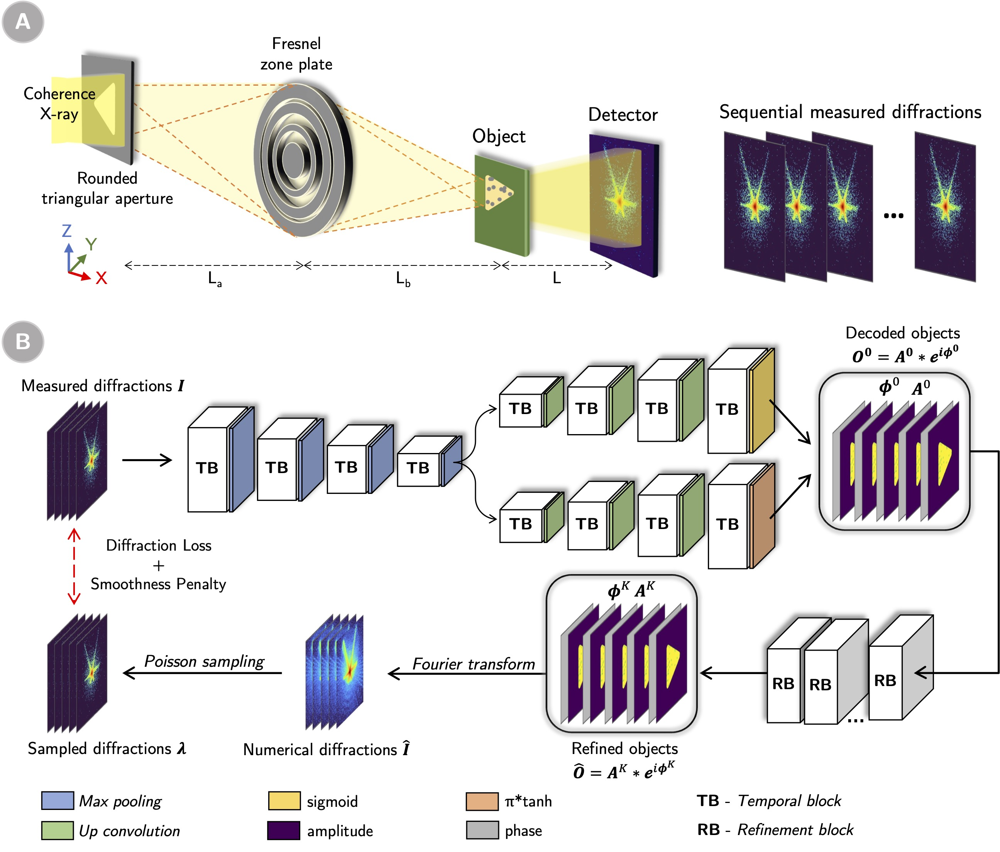

[](https://opensource.org/licenses/MIT)
[](https://badge.fury.io/py/pid3net)

[](https://pepy.tech/project/pid3net)


# Table of Contents

* [Introduction](#introduction)
* [PID3Net Framework](#pid3net-framework)
* [Installation](#installation)
* [Datasets](#datasets)
<!-- * [Usage](#usage)
* [References](#references) -->

<a name="introduction"></a>

# Introduction
This repository is the official implementation of [PID3Net: a deep learning approach for single-shot coherent X-ray diffraction imaging of dynamic phenomena](https://www.nature.com/articles/s41524-025-01549-x).

Please cite us as

```
@article{Vu2025,
author = {Vu, Tien-Sinh and Ha, Minh-Quyet and Bachtiar, Adam Mukharil and Dao, Duc-Anh and Tran, Truyen and Kino, Hiori and Takazawa, Shuntaro and Ishiguro, Nozomu and Sasaki, Yuhei and Abe, Masaki and Uematsu, Hideshi and Okawa, Naru and Ozaki, Kyosuke and Kobayashi, Kazuo and Honjo, Yoshiaki and Nishino, Haruki and Joti, Yasumasa and Hatsui, Takaki and Takahashi, Yukio and Dam, Hieu-Chi},
doi = {10.1038/s41524-025-01549-x},
issn = {2057-3960},
journal = {npj Computational Materials},
number = {1},
pages = {66},
title = {{PID3Net: a deep learning approach for single-shot coherent X-ray diffraction imaging of dynamic phenomena}},
url = {https://doi.org/10.1038/s41524-025-01549-x},
volume = {11},
year = {2025}
}
```

We developed a `Physics-Informed Deep learning Network for Dynamic Diffraction imaging (PID3Net)` that takes advantage of a neural network to reconstruct the phase image of objects in Coherent x-ray diffraction imaging (CXDI) experiment.

 PID3Net leverages established physical principles and utilizes experimental conditions to guide the network’s optimization. By introducing physics-based priors via the measurement-informed refinement block (RB) and the loss functions, PID3Net ensure that our reconstructions remain consistent with the underlying diffraction physics rather than relying solely on learned statistical patterns.

PID3Net is a self-supervised learning approach, where the network learns directly from the measured diffraction data without relying on external reference images or human-provided labels.

<a name="pid3net-framework"></a>

# PID3Net framework

Figure 1 shows the overall schematic of the model.



<div align='center'><strong>Figure 1. Schematic of  PID3Net.</strong></div>

<a name="usage"></a>

# Installation

Firstly, create a conda environment to install the package, for example:
```
conda create -n test python==3.9
source activate test
```

### Optional GPU dependencies

For hardwares that have CUDA support, the <b>tensorflow version with gpu options</b> should be installed. Please follow the installation from https://www.tensorflow.org/install for more details.

Tensorflow can  also be installed from ```conda``` for simplification settings:
```
conda install -c conda-forge tensorflow-gpu
```

#### Method 1 (directly install from git)
You can install the lastes development version of PID3Net from this repo and install using:
```
git clone https://github.com/sinhvt3421/PID3Net
cd PID3Net
python -m pip install -e .
```

<a name="dataset"></a>

# Datasets

## Experiments

The settings for experiments specific is placed in the folder [configs](configs)

We provide an implementation for the Moving Ta test chart, gold nanoparticles AuNP [1] experiments.