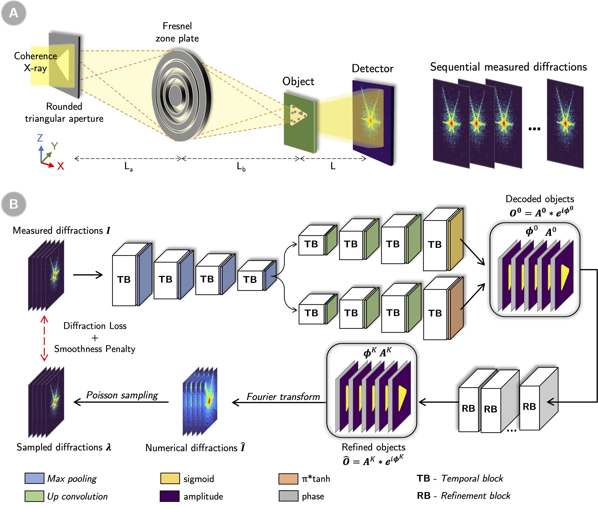

[](https://opensource.org/licenses/MIT)
[](https://badge.fury.io/py/pid3net)

[](https://pepy.tech/project/pid3net)


# Table of Contents

* [Introduction](#introduction)
* [PID3Net Framework](#pid3net-framework)
* [Installation](#installation)
* [Usage](#usage)
* [Configuration Reference](#configuration-reference)
* [Project Structure](#project-structure)
* [Output Files](#output-files)
* [Datasets](#datasets)
* [References](#references)


<a name="introduction"></a>

# Introduction
This repository is the official implementation of [PID3Net: a deep learning approach for single-shot coherent X-ray diffraction imaging of dynamic phenomena](https://www.nature.com/articles/s41524-025-01549-x).

Please cite us as

```
@article{Vu2025,
author = {Vu, Tien-Sinh and Ha, Minh-Quyet and Bachtiar, Adam Mukharil and Dao, Duc-Anh and Tran, Truyen and Kino, Hiori and Takazawa, Shuntaro and Ishiguro, Nozomu and Sasaki, Yuhei and Abe, Masaki and Uematsu, Hideshi and Okawa, Naru and Ozaki, Kyosuke and Kobayashi, Kazuo and Honjo, Yoshiaki and Nishino, Haruki and Joti, Yasumasa and Hatsui, Takaki and Takahashi, Yukio and Dam, Hieu-Chi},
doi = {10.1038/s41524-025-01549-x},
issn = {2057-3960},
journal = {npj Computational Materials},
number = {1},
pages = {66},
title = {{PID3Net: a deep learning approach for single-shot coherent X-ray diffraction imaging of dynamic phenomena}},
url = {https://doi.org/10.1038/s41524-025-01549-x},
volume = {11},
year = {2025}
}
```

We developed a `Physics-Informed Deep learning Network for Dynamic Diffraction imaging (PID3Net)` that takes advantage of a neural network to reconstruct the phase image of objects in Coherent x-ray diffraction imaging (CXDI) experiment.

 PID3Net leverages established physical principles and utilizes experimental conditions to guide the network's optimization. By introducing physics-based priors via the measurement-informed refinement block (RB) and the loss functions, PID3Net ensure that our reconstructions remain consistent with the underlying diffraction physics rather than relying solely on learned statistical patterns.

PID3Net is a self-supervised learning approach, where the network learns directly from the measured diffraction data without relying on external reference images or human-provided labels.

<a name="pid3net-framework"></a>

# PID3Net framework

Figure 1 shows the overall schematic of the model.



<div align='center'><strong>Figure 1. Schematic of  PID3Net.</strong></div>

# Installation

Firstly, create a conda environment to install the package, for example:
```
conda create -n test python==3.9
source activate test
```

### Optional GPU dependencies

For hardwares that have CUDA support, the <b>tensorflow version with gpu options</b> should be installed. Please follow the installation from https://www.tensorflow.org/install for more details.

Tensorflow can  also be installed from ```conda``` for simplification settings:
```
conda install -c conda-forge tensorflow-gpu
```

#### Method 1 (directly install from git)
You can install the lastes development version of PID3Net from this repo and install using:
```
git clone https://github.com/sinhvt3421/PID3Net
cd PID3Net
python -m pip install -e .
```

<a name="usage"></a>

# Usage

## Quick Start

Train the default PID3NetV3 model on Mg alloy refractive data:

```bash
python train_ssp.py configs/MgAlloy_refractive.yaml
```

Run inference only (skip training, use existing weights):

```bash
python train_ssp.py configs/MgAlloy_refractive.yaml --inference-only
```

## CLI Reference

```
python train_ssp.py <dataset_config> [options]
```

| Argument | Type | Default | Description |
|---|---|---|---|
| `dataset` | str | *required* | Path to dataset YAML config file |
| `--mode` | str | `3d3` | Model architecture: `3d3`, `2d`, `autonn`, `ptychonn` |
| `--n_refine` | int | `5` | Number of iterative refinement steps in the refinement block |
| `--probe_mode` | str | `multi_c` | Probe function mode: `single`, `single_c`, `multi`, `multi_c` |
| `--pretrained` | str | `""` | Path to pretrained model weights (.tf checkpoint) |
| `--dist` | flag | `False` | Use Poisson distribution output (default: MSE loss) |
| `--epoch` | int | `20` | Number of training epochs |
| `--seed` | int | `0` | Random seed for reproducibility |
| `--inference-only` | flag | `False` | Skip training, run inference only |

## Model Modes

### `3d3` — PID3NetV3 (default, recommended)

The main 3D temporal model with encoder-decoder backbone, physics-informed refinement block, and optional time-decay fusion for initialization. Supports refractive index mode.

```bash
python train_ssp.py configs/MgAlloy_refractive.yaml --mode 3d3
```

### `2d` — PIBaseD3Net (2D baseline)

A 2D spatial baseline using Conv2D encoder-decoder. Processes single diffraction patterns without temporal context.

```bash
python train_ssp.py configs/MgAlloy_refractive.yaml --mode 2d
```

### `autonn` — AutoPhaseNN (3D baseline)

A 3D baseline adapted from [AutoPhaseNN](https://github.com/YudongYao/AutoPhaseNN) with custom encoder-decoder and forward FFT propagation.

```bash
python train_ssp.py configs/AuNP_1s_data.yaml --mode autonn
```

### `ptychonn` — PtychoNN (2D baseline)

A 2D baseline adapted from [PtychoNN](https://github.com/mcherukara/PtychoNN) with Conv2D encoder-decoder.

```bash
python train_ssp.py configs/AuNP_1s_data.yaml --mode ptychonn
```

## Probe Modes

The probe mode controls how the illumination probe function is handled during iterative refinement:

| Mode | Probe Type | Update Method | Description |
|---|---|---|---|
| `single` | Single probe | Gradient | One probe function, analytic gradient update |
| `single_c` | Single probe | CNN | One probe function, CNN-learned update |
| `multi` | Multi-mode | Gradient | Multiple probe modes, analytic gradient update |
| `multi_c` | Multi-mode | CNN | Multiple probe modes, CNN-learned update (default) |

```bash
# Single probe with analytic update
python train_ssp.py configs/MgAlloy_refractive.yaml --probe_mode single

# Single probe with CNN-learned update
python train_ssp.py configs/MgAlloy_refractive.yaml --probe_mode single_c

# Multi-mode probe with analytic update
python train_ssp.py configs/MgAlloy_refractive.yaml --probe_mode multi

# Multi-mode probe with CNN-learned update (default)
python train_ssp.py configs/MgAlloy_refractive.yaml --probe_mode multi_c
```

## Training Options

### Loss function

By default, the model uses masked squared error (MSE) loss. Use Poisson negative log-likelihood with `--dist`:

```bash
# MSE loss (default)
python train_ssp.py configs/MgAlloy_refractive.yaml

# Poisson loss
python train_ssp.py configs/MgAlloy_refractive.yaml --dist
```

### Refinement steps

Control the number of physics-informed iterative refinement steps:

```bash
# Default 5 refinement steps (optimal for current datasets)
python train_ssp.py configs/MgAlloy_refractive.yaml --n_refine 5

# More refinement steps may better convergence but slowdown training
python train_ssp.py configs/MgAlloy_refractive.yaml --n_refine 7

# No refinement (encoder-decoder only)
python train_ssp.py configs/MgAlloy_refractive.yaml --n_refine 0
```

### Resume training from pretrained weights

```bash
python train_ssp.py configs/MgAlloy_refractive.yaml \
    --pretrained trained_models/previous_run/models/model_unsp.tf
```

### Reproducibility

```bash
python train_ssp.py configs/MgAlloy_refractive.yaml --seed 0
```

## Full Example

Train PID3NetV3 with multi-mode CNN probe, 5 refinement steps, Poisson loss, for 20 epochs:

```bash
python train_ssp.py configs/MgAlloy_refractive.yaml \
    --mode 3d3 \
    --probe_mode multi_c \
    --n_refine 5 \
    --dist \
    --epoch 20 \
    --seed 0
```

<a name="configuration-reference"></a>

# Configuration Reference

Training is configured via YAML files in the `configs/` directory. Each config has two sections: `model` (architecture) and `hyper` (training hyperparameters).

## Example Config

```yaml
model:
  filters: 8          # Base filter count (doubles each encoder level)
  kernel: 3           # Convolution kernel size
  k_pool: 2           # Pooling kernel size
  pool: "max"         # Pooling type: "max" or "stride"
  n_cov: 4            # Number of encoder blocks
  n_dcov: 4           # Number of decoder blocks
  act: "swish"        # Activation function
  img_size: 512       # Input diffraction pattern size (pixels), should be factor of 2^n_cov

hyper:
  batch_size: 2       # Training batch size
  loss: 1.0           # Loss threshold for Poisson NLL min_val
  lr: 0.001           # Initial learning rate (cosine decay schedule)
  n_time: 5           # Temporal window size (frames per sequence)
  n_refine: 5         # Refinement block iterations
  dist: false         # Use Poisson distribution output
  tvo: false          # TV regularization mode (false=on amp/phase, true=on object)
  sample: "mgall"     # Dataset loader key: "mgall", "aunp", "chart", "simu"
  save_path: "trained_models/experiment_name"

  # File paths
  train_data: "/path/to/diffraction_data.npz"
  probe: "/path/to/probe_function.npy"
  probe_mode: "multi_c"    # Probe mode (overridden by CLI --probe_mode)
  probe_norm: 1.0          # Exposure time normalization factor (default probe intensity is normed to 1 second)
  masking: "/path/to/mask.npy"          # Spatial mask file (false to disable)
  init_pty: "/path/to/ptycho_init.npy"  # Initial reconstruction from pytchography (false to disable)
```
<!-- 
## Model Section

| Key | Type | Description |
|---|---|---|
| `filters` | int | Base number of convolutional filters. Each encoder level doubles this. |
| `kernel` | int | Spatial kernel size for convolutions. |
| `k_pool` | int | Pooling kernel size for downsampling. |
| `pool` | str | Pooling strategy: `"max"` (MaxPool) or `"stride"` (strided conv). |
| `n_cov` | int | Number of encoder blocks (downsampling levels). |
| `n_dcov` | int | Number of decoder blocks (upsampling levels). |
| `act` | str | Activation function for conv layers (e.g., `"swish"`, `"relu"`). |
| `img_size` | int | Input image size in pixels. Diffraction patterns are padded to this size. | -->

<!-- ## Hyperparameter Section

| Key | Type | Description |
|---|---|---|
| `batch_size` | int | Number of samples per training batch. |
| `loss` | float | Threshold for Poisson NLL loss (min intensity value). |
| `lr` | float | Initial learning rate. Uses cosine decay schedule during training. |
| `n_time` | int | Number of temporal frames per input sequence (3D models only). |
| `n_refine` | int | Number of physics-informed refinement iterations. |
| `dist` | bool | If true, use Poisson NLL loss; if false, use masked MSE. |
| `tvo` | bool | TV regularization mode. `false`: apply TV on amplitude and phase separately. `true`: apply TV on the combined complex object. |
| `sample` | str | Dataset loader key. Available: `"mgall"`, `"aunp"`, `"chart"`, `"simu"`. |
| `save_path` | str | Base directory for saving checkpoints and results. |
| `train_data` | str | Path to training data file (`.npz` format). |
| `probe` | str | Path to probe function file (`.npy`, complex64 array). |
| `probe_mode` | str | Probe mode: `"single"`, `"single_c"`, `"multi"`, `"multi_c"`. |
| `probe_norm` | float/bool | Exposure time normalization factor. Set to `false` to disable. |
| `masking` | str/bool | Path to spatial mask file (`.npy`). Set to `false` to disable. |
| `init_pty` | str/bool | Path to initial ptychographic reconstruction (`.npy`). Enables time-decay fusion. Set to `false` to disable. | -->

<a name="project-structure"></a>

# Project Structure

```
PID3Net_v4/
├── train_ssp.py                     # Main training and inference script
├── configs/                         # YAML configuration files per dataset
│   ├── MgAlloy_refractive.yaml
│   ├── AuNP_1s_data.yaml
│   ├── Moving_chart_500ms.yaml
│   └── ...
├── pid3net/
│   ├── losses.py                    # Loss functions (Poisson NLL, masked MSE, total variation)
│   ├── layers/
│   │   ├── activations.py           # Trainable activation layers (PhaseConstraint, Mpi)
│   │   ├── conv_blocks.py           # 2D/3D encoder-decoder building blocks
│   │   ├── encoders.py              # TBEncoder (3D temporal), CNNEncoder (2D spatial)
│   │   ├── decoders.py              # TBDecoder (3D temporal), CNNDecoder (2D spatial)
│   │   ├── physics_layers.py        # RefineLayer, TV regularization, complex arithmetic
│   │   └── fusion.py                # TimeDecayFusion for initial reconstruction blending
│   ├── models/
│   │   ├── base_model.py            # PtyBase: shared training, inference, callbacks
│   │   ├── PID3Net_v3.py            # PID3NetV3: main model with refractive refinement
│   │   ├── baseline.py              # PIBaseD3Net: 2D baseline model
│   │   ├── AutophaseNN.py           # AutoPhaseNN: 3D baseline (adapted from external)
│   │   └── PtychoNN.py              # PtychoNN: 2D baseline (adapted from external)
│   └── utils/
│       ├── general.py               # Dataset loading functions per sample type
│       └── datagenerator_ssp.py     # Keras Sequence data generator for training
└── resources/                       # Figures and supplementary files
```

<a name="output-files"></a>

# Output Files

After training, the following files are saved under the `save_path` directory:

```
<save_path>/
├── config.yaml                                # Copy of the training configuration
├── hist_train.npy                             # Training history (loss per epoch)
├── models/
│   └── model_unsp.tf                          # Best model weights (by loss)
├── monitor/
│   ├── epoch_0001.png                         # Reconstruction visualization per epoch
│   ├── epoch_0002.png
│   └── ...
└── object_reconstruction_<mode>.npz           # Final reconstructed amplitude and phase
```

The reconstruction file `object_reconstruction_<mode>.npz` contains a list `[amplitude, phase]` where each is a NumPy array of shape `(N_frames, H, W)`.

To load results:

```python
import numpy as np

data = np.load("path/to/object_reconstruction_3d3.npz", allow_pickle=True)
amplitude, phase = data["arr_0"]
```

<a name="dataset"></a>

# Datasets

## Experiments

The settings for experiments specific is placed in the folder [configs](configs)

We provide an implementation for the Moving Ta test chart [1], gold nanoparticles AuNP [2] experiments.

<a name="reference"></a>

# References

[1] Tien-Sinh Vu, T., Takazawa & Chi, D. H. Diffraction intensity for phase retrieval of Ta test chart and AuNP dynamics motion using single-shot coherrent X-ray diffraction imaging. https://doi.org/10.5281/zenodo.12144981 (2024)

[2] Takazawa, S. et al. Coupling x-ray photon correlation spectroscopy and dynamic coherent x-ray diffraction imaging: Particle motion analysis from nano-to-micrometer scale. Phys. Rev. Res. 5, L042019 (2023) https://doi.org/10.1103/PhysRevResearch.5.L042019.
