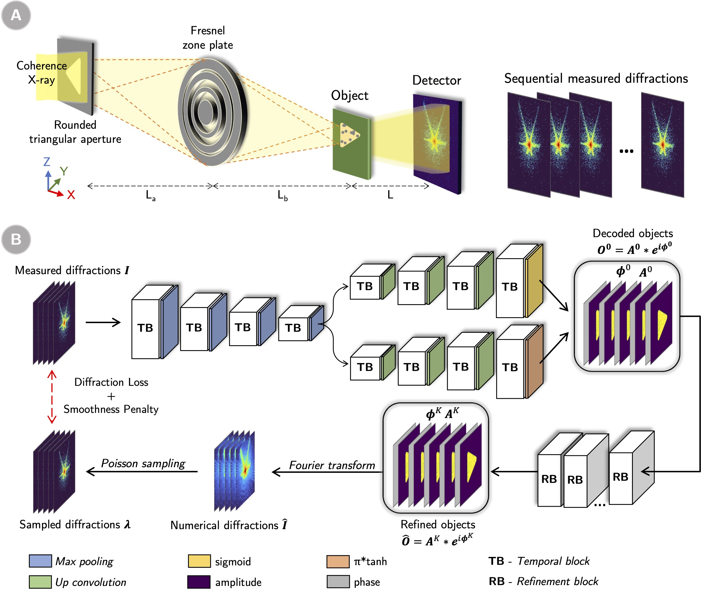

[](https://opensource.org/licenses/MIT)
[](https://badge.fury.io/py/pid3net)

[](https://pepy.tech/project/pid3net)


# Table of Contents

* [Introduction](#introduction)
* [PID3Net Framework](#pid3net-framework)
* [Installation](#installation)
* [Usage](#usage)
* [Configuration Reference](#configuration-reference)
* [Output Files](#output-files)
* [Datasets](#datasets)
* [References](#references)


<a name="introduction"></a>

# Introduction
This repository is the official implementation of [PID3Net: a deep learning approach for single-shot coherent X-ray diffraction imaging of dynamic phenomena](https://www.nature.com/articles/s41524-025-01549-x).

Please cite us as

```
@article{Vu2025,
author = {Vu, Tien-Sinh and Ha, Minh-Quyet and Bachtiar, Adam Mukharil and Dao, Duc-Anh and Tran, Truyen and Kino, Hiori and Takazawa, Shuntaro and Ishiguro, Nozomu and Sasaki, Yuhei and Abe, Masaki and Uematsu, Hideshi and Okawa, Naru and Ozaki, Kyosuke and Kobayashi, Kazuo and Honjo, Yoshiaki and Nishino, Haruki and Joti, Yasumasa and Hatsui, Takaki and Takahashi, Yukio and Dam, Hieu-Chi},
doi = {10.1038/s41524-025-01549-x},
issn = {2057-3960},
journal = {npj Computational Materials},
number = {1},
pages = {66},
title = {{PID3Net: a deep learning approach for single-shot coherent X-ray diffraction imaging of dynamic phenomena}},
url = {https://doi.org/10.1038/s41524-025-01549-x},
volume = {11},
year = {2025}
}
```

We developed a `Physics-Informed Deep learning Network for Dynamic Diffraction imaging (PID3Net)` that takes advantage of a neural network to reconstruct the phase image of objects in Coherent x-ray diffraction imaging (CXDI) experiment.

 PID3Net leverages established physical principles and utilizes experimental conditions to guide the network's optimization. By introducing physics-based priors via the measurement-informed refinement block (RB) and the loss functions, PID3Net ensure that our reconstructions remain consistent with the underlying diffraction physics rather than relying solely on learned statistical patterns.

PID3Net is a self-supervised learning approach, where the network learns directly from the measured diffraction data without relying on external reference images or human-provided labels.

<a name="pid3net-framework"></a>

# PID3Net framework

Figure 1 shows the overall schematic of the model.



<div align='center'><strong>Figure 1. Schematic of  PID3Net.</strong></div>

# Installation

Firstly, create a conda environment to install the package, for example:
```
conda create -n test python==3.9
source activate test
```

### Optional GPU dependencies

For hardwares that have CUDA support, the <b>tensorflow version with gpu options</b> should be installed. Please follow the installation from https://www.tensorflow.org/install for more details.

Tensorflow can  also be installed from ```conda``` for simplification settings:
```
conda install -c conda-forge tensorflow-gpu
```

#### Method 1 — from a source checkout

Clone the repo and install in editable mode:

```bash
git clone https://github.com/sinhvt3421/PID3Net
cd PID3Net
python -m pip install -e .
```

#### Method 2 — wheel build

```bash
python -m pip install build
python -m build
python -m pip install dist/pid3net-*.whl
```

#### Using PID3Net as a library

After installation the package is importable from any Python project:

```python
from pid3net.models import PID3Net, MODEL_REGISTRY, get_spec
from pid3net.layers.physics_layers import RefineLayer
```

<a name="usage"></a>

# Usage

## Quick Start

Train the default PID3Net model on the bundled moving-chart data using the
installed console script:

```bash
pid3net-train configs/Moving_chart_1ms.yaml
```

Equivalently, via Python (also works from a source checkout without install):

```bash
python -m pid3net.train configs/Moving_chart_1ms.yaml
python train_ssp.py        configs/Moving_chart_1ms.yaml   # legacy shim
```

Run inference only (skip training, use existing weights):

```bash
pid3net-train configs/Moving_chart_1ms.yaml --inference-only
```

## CLI Reference

```
pid3net-train <dataset_config> [options]
```

| Argument | Type | Default | Description |
|---|---|---|---|
| `dataset` | str | *required* | Path to dataset YAML config file |
| `--model` | str | `3d3` | Model architecture: `3d3` (PID3Net, default) or `2d` (PIBaseD3Net ablation) |
| `--n_refine` | int | `5` | Number of iterative refinement steps in the refinement block |
| `--probe_mode` | str | `multi_c` | Probe function mode: `single_c`, `multi_c` |
| `--rec_mode` | str | `refractive` | Reconstruction mode: `polar` or `refractive` |
| `--update_method` | str | `pie` | Refinement rule: `pie` (ePIE) or `raar` |
| `--pretrained` | str | `""` | Path to pretrained model weights (.tf checkpoint) |
| `--dist` | flag | `False` | Use Poisson distribution output (default: MSE loss) |
| `--epoch` | int | `20` | Number of training epochs |
| `--seed` | int | `0` | Random seed for reproducibility |
| `--inference-only` | flag | `False` | Skip training, run inference only |

## Model Modes

### `3d3` — PID3Net (default, recommended)

The main 3D temporal model with encoder-decoder backbone, physics-informed refinement block, and optional time-decay fusion for initialization. Supports refractive index mode.

```bash
pid3net-train configs/Moving_chart_1ms.yaml --model 3d3
```

### `2d` — PIBaseD3Net (2D ablation)

A 2D spatial ablation of PID3Net using Conv2D encoder-decoder. Processes single diffraction patterns without temporal context — useful for measuring the contribution of the temporal axis.

```bash
pid3net-train configs/Moving_chart_1ms.yaml --model 2d
```

## Probe Modes

The probe mode controls how the illumination probe function is handled during iterative refinement:

| Mode | Probe Type | Update Method | Description |
|---|---|---|---|
| `single_c` | Single probe | CNN | One probe function, CNN-learned update |
| `multi_c` | Multi-mode | CNN | Multiple probe modes, CNN-learned update (default) |

```bash
# Single probe with CNN-learned update
python train_ssp.py configs/Moving_chart_1ms.yaml --probe_mode single_c

# Multi-mode probe with CNN-learned update (default)
python train_ssp.py configs/Moving_chart_1ms.yaml --probe_mode multi_c
```

## Training Options

### Loss function

By default, the model uses masked squared error (MSE) loss. Use Poisson negative log-likelihood with `--dist`:

```bash
# MSE loss (default)
python train_ssp.py configs/Moving_chart_1ms.yaml

# Poisson loss
python train_ssp.py configs/Moving_chart_1ms.yaml --dist
```

### Refinement steps

Control the number of physics-informed iterative refinement steps:

```bash
# Default 5 refinement steps (optimal for current datasets)
python train_ssp.py configs/Moving_chart_1ms.yaml --n_refine 5

# More refinement steps may better convergence but slowdown training
python train_ssp.py configs/Moving_chart_1ms.yaml --n_refine 7

# No refinement (encoder-decoder only)
python train_ssp.py configs/Moving_chart_1ms.yaml --n_refine 0
```

### Resume training from pretrained weights

```bash
python train_ssp.py configs/Moving_chart_1ms.yaml \
    --pretrained trained_models/previous_run/models/model_unsp.tf
```

### Reproducibility

```bash
python train_ssp.py configs/Moving_chart_1ms.yaml --seed 0
```

## Full Example

Train PID3Net with multi-mode CNN probe, 5 refinement steps, Poisson loss, for 20 epochs:

```bash
pid3net-train configs/Moving_chart_1ms.yaml \
    --model 3d3 \
    --probe_mode multi_c \
    --n_refine 5 \
    --dist \
    --epoch 20 \
    --seed 0
```

<a name="configuration-reference"></a>

# Configuration Reference

Training is configured via YAML files in the `configs/` directory. Each config has two sections: `model` (architecture) and `hyper` (training hyperparameters).

## Example Config

```yaml
model:
  filters: 8          # Base filter count (doubles each encoder level)
  kernel: 3           # Convolution kernel size
  k_pool: 2           # Pooling kernel size
  pool: "max"         # Pooling type: "max" or "stride"
  n_cov: 4            # Number of encoder blocks
  n_dcov: 4           # Number of decoder blocks
  act: "swish"        # Activation function
  img_size: 512       # Input diffraction pattern size (pixels), should be factor of 2^n_cov

hyper:
  batch_size: 2       # Training batch size
  loss: 1.0           # Loss threshold for Poisson NLL min_val
  lr: 0.001           # Initial learning rate (cosine decay schedule)
  n_time: 5           # Temporal window size (frames per sequence)
  n_refine: 5         # Refinement block iterations
  dist: false         # Use Poisson distribution output
  tvo: false          # TV regularization mode (false=on amp/phase, true=on object)
  sample: "chart"     # Dataset loader key: "chart", "aunp", "mgall", "simu"
  save_path: "trained_models/experiment_name"

  # File paths
  train_data: "/path/to/diffraction_data.npz"
  probe: "/path/to/probe_function.npy"
  probe_mode: "multi_c"    # Probe mode (overridden by CLI --probe_mode)
  probe_norm: 1.0          # Exposure time normalization factor (default probe intensity is normed to 1 second)
  masking: "/path/to/mask.npy"          # Spatial mask file (false to disable)
  init_pty: "/path/to/ptycho_init.npy"  # Initial reconstruction from pytchography (false to disable)
```

## Hyperparameter Section

### Core training

| Key | Type | Default | Description |
|---|---|---|---|
| `batch_size` | int | — | Number of samples per training batch. |
| `loss` | float | — | Min-intensity threshold for the Poisson NLL loss mask. |
| `dist` | bool | false | If true, use Poisson NLL loss; if false, use masked MSE. CLI `--dist`. |
| `n_time` | int | — | Number of temporal frames per input sequence (3D models only). |
| `sample` | str | — | Dataset loader key. One of `"mgall"`, `"aunp"`, `"chart"`, `"simu"`. |
| `save_path` | str | — | Base directory for checkpoints and results (suffix auto-appended). |

### Physics (probe / mask / exposure)

| Key | Type | Default | Description |
|---|---|---|---|
| `train_data` | str | — | Path to diffraction `.npz` (`arr_0` shape `[N, H, W]`). |
| `probe` | str | — | Path to probe `.npy`. Shape `[H, W]` (single) or `[M, H, W]` (multi). |
| `probe_mode` | str | `"multi_c"` | One of  `"single_c"`, `"multi_c"`. CLI `--probe_mode`. |
| `probe_norm` | float / false | false | Exposure-time amplitude scaling (probe is √-scaled by this). |
| `masking` | str / false | false | Path to spatial mask `.npy` `[H, W]` (binary float), or `false`. |

### Refinement

| Key | Type | Default | Description |
|---|---|---|---|
| `n_refine` | int | 5 | Number of iterative refinement steps. CLI `--n_refine`. |
| `rec_mode` | str | `"refractive"` | `"polar"` (`amp·exp(jφ)`) or `"refractive"` (`φ + j·amp`). CLI `--rec_mode`. |
| `update_method` | str | `"pie"` | Refinement rule: `"pie"` (ePIE) or `"raar"` (Relaxed Averaged Alternating Reflections). CLI `--update_method`. |

See `docs/refinement_design.md` for the full derivation and the design log.

### Optional: Initialise from a known ptychographic reconstruction

| Key | Type | Default | Description |
|---|---|---|---|
| `init_pty` | str / false | false | `.npy` storing `[amp_init, phase_init]`, each `[H, W]` float32. Enables `TimeDecayFusion`. |

### Optional: Phase prior (high-exposure → low-exposure guidance)

| Key | Type | Default | Description |
|---|---|---|---|
| `use_prior_phase` | bool | false | Enables `PriorPhaseFusion` (pre-refinement) and `PriorPhaseLoss` (annealing MSE). |
| `use_prior_amp` | bool | false | Also include amplitude prior (often weak; usually leave off). |
| `phase_dir` | str / null | null | Directory of per-step prior files. |
| `phase_file_pattern` | str | `"f{time:04d}.npy"` | Filename template (uses `{time}`). |
| `diff_dt_ms` | float | 1.0 | Diffraction frame interval in ms. |
| `phase_dt_ms` | float | 1.0 | Phase prior frame interval in ms. |
| `lambda_prior` | float | 10.0 | Initial prior-loss weight (cosine-annealed). |
| `lambda_prior_min` | float | 1.0 | Final prior-loss weight. |

## Applying the model to a new dataset

A new dataset needs three things: (1) a diffraction stack, (2) a probe function, and (3) a config pointing at them.

**1. Prepare your data files.**

| File | Format | Shape | Dtype |
|---|---|---|---|
| diffraction stack | `.npz` with key `"arr_0"` | `[N_frames, H, W]` | float32/64 (intensity) |
| probe | `.npy` | `[H_p, W_p]` or `[M, H_p, W_p]` | complex64 |
| mask (optional) | `.npy` | `[H, W]` | float32 (0/1) |
| init from ptycho (optional) | `.npy` | `[amp_init, phase_init]` each `[H, W]` | float32 |

Place them anywhere; you'll reference them from your config.

**2. Copy the template config.**

```bash
cp configs/_template.yaml configs/my_experiment.yaml
```

Edit `configs/my_experiment.yaml`:
- Set `hyper.sample` to one of the built-in loaders (`"mgall"`, `"aunp"`, `"chart"`, `"simu"`) — pick the one with preprocessing closest to your data. To add a custom loader, append an entry to `pid3net.utils.general.dataset_functions`.
- Set `hyper.train_data`, `hyper.probe`, and `hyper.masking` paths. Use the `${DATA_ROOT}` placeholder for portability.
- Adjust `model.img_size` to your diffraction pattern size.
- Tweak `hyper.n_time` (for 3D models) to match the temporal window you want.

**3. Run training.**

```bash
python train_ssp.py configs/my_experiment.yaml \
    --data-root /absolute/path/to/your/data \
    --epoch 20
```

<a name="output-files"></a>

# Output Files

After training, the following files are saved under the `save_path` directory:

```
<save_path>/
├── config.yaml                                # Copy of the training configuration
├── hist_train.npy                             # Training history (loss per epoch)
├── models/
│   └── model_unsp.tf                          # Best model weights (by loss)
├── monitor/
│   ├── epoch_0001.png                         # Reconstruction visualization per epoch
│   ├── epoch_0002.png
│   └── ...
└── object_reconstruction_<mode>.npz           # Final reconstructed amplitude and phase
```

The reconstruction file `object_reconstruction_<mode>.npz` contains a list `[amplitude, phase]` where each is a NumPy array of shape `(N_frames, H, W)`.

To load results:

```python
import numpy as np

data = np.load("path/to/object_reconstruction_3d3.npz", allow_pickle=True)
amplitude, phase = data["arr_0"]
```

<a name="dataset"></a>

# Datasets

## Experiments

The settings for experiments specific is placed in the folder [configs](configs)

We provide an implementation for the Moving Ta test chart [1], gold nanoparticles AuNP [2] experiments.

<a name="reference"></a>

# References

[1] Tien-Sinh Vu, T., Takazawa & Chi, D. H. Diffraction intensity for phase retrieval of Ta test chart and AuNP dynamics motion using single-shot coherrent X-ray diffraction imaging. https://doi.org/10.5281/zenodo.12144981 (2024)

[2] Takazawa, S. et al. Coupling x-ray photon correlation spectroscopy and dynamic coherent x-ray diffraction imaging: Particle motion analysis from nano-to-micrometer scale. Phys. Rev. Res. 5, L042019 (2023) https://doi.org/10.1103/PhysRevResearch.5.L042019.
